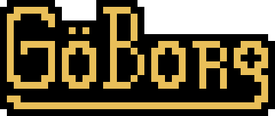

# GöBorg - a web interface for Dungeon Masters compatible with MÖRK BORG
#### GöBorg is an independent production and is not affiliated with Ockult Örtmästare Games or Stockholm Kartell. It is published under the [MÖRK BORG Third Party License](https://morkborg.com/license/).

  
GöBorg 0.0.0.1

## Instalation:
### Requirements:
 - podman or docker
 - git

### Instalation process:
 - clone the repository with `git clone https://github.com/nonelone/go-borg`
 - cd to it using `cd go-borg`
 - run `run.sh` or `run.bat`

## Licensing:
 - This software is published under MIT license.
 - The content of the software i.e. the Prophecy, names of creatures, locations and entities of the game world **and** Compatible with MÖRK BORG logo belong to authors of MÖRK BORG and are used acording to the [MÖRK BORG Third Party License](https://morkborg.com/license/).
 - Other images created by me,git including but not limited to GöBorg logo, are licensed under [CC BY-SA 4.0](https://creativecommons.org/licenses/by-sa/4.0/).

#### MÖRK BORG is copyright Ockult Örtmästare Games and Stockholm Kartell.

## TODO:
- bat script
- rules for admin
- rules for users